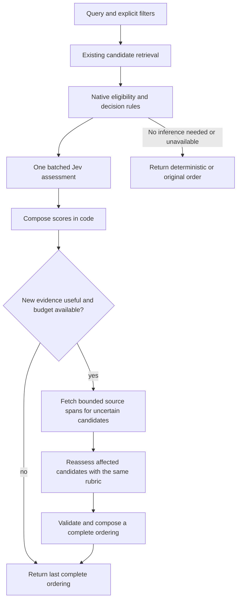

# Jev retrieval, reranking, and knowledge classification

Date: 2026-09-22

Status: implementation specification. Benchmark findings are observed; thresholds, budgets, schema, and configuration below are proposed requirements. This document does not enable a production feature.

## Decision

Proceed with Jev as a fast reranking backend, measure whether additional evidence and typed signals improve its quality, and use controlled topic classification to improve knowledge discovery. Build on the existing isolated decision benchmarks and declarative rules engine. Keep candidate retrieval, ranking, classification, and vector changes independently measurable.

The initial reranking experiment is a latency success and supports this investment. Production acceptance will consider quality and latency together. The previous experiment's stricter gate remains part of the historical record; it is not retroactively changed.

Deliver five changes in dependency order:

1. Expand and independently label the retrieval, classification, and connection corpus.
2. Add an opt-in Jev reranker with bounded execution and the existing local backend as a comparator.
3. Test multiple typed signals, native rules, and selective refinement with additional evidence.
4. Classify newly created and updated nodes asynchronously, with durable revision checks and owned topic membership.
5. Test topic-based candidate retrieval and semantic-vector enrichment separately, then promote only the measured combinations.

No new daemon, message broker, graph database, third-party rules engine, or TypeSafe SDK is required. Reuse Python, SQLite, the installed HTTP client, and the current benchmark infrastructure. Jev supplies typed judgments; Hippo retains retrieval, source policy, score composition, and answer synthesis.

## Evidence and interpretation

The frozen knowledge experiment is stored outside the repository at:

`~/.local/share/hippo-bench/decisions/knowledge-1790057730710/`

Its `protocol.json`, `freeze.json`, `rerank-report.json`, `rerank-decision.json`, `validation.json`, and `briefing.md` describe the input, observed results, original gate, and provenance checks. Classification evidence is under `tags-1790062009590/`. Relative artifact names in this specification refer to that external experiment. Preserve those files and their recorded implementation hashes.

### Reranking

All arms evaluated the same 50 questions and candidate pools. Only 33 pools contained the known reference node. Other candidate nodes were not exhaustively judged, so these are known-target metrics, not complete relevance judgments.

| Arm | Target first | Target in top five | Reciprocal rank, mean | Median decision time | p95 decision time |
| --- | --- | --- | --- | --- | --- |
| Existing retrieval | 12/50 | 26/50 | 0.3699 | Not a reranker | Not a reranker |
| Native rules | 13/50 | 26/50 | 0.3908 | 0.360 ms | 0.407 ms |
| Jev 1.13.0 | 25/50 | 32/50 | 0.5667 | 184.064 ms | 311.830 ms |
| Existing local LLM | 27/50 | 33/50 | 0.5917 | 73,858.937 ms | 150,784.753 ms |

Each decision arm completed 50/50 inputs without reported errors or abstentions. Jev improved known-target ordering over retrieval and was approximately 401 times faster than the measured local call. The local model was Qwen3.6-35B-A3B-Uncensored-Heretic-MLX-8bit on shared inference infrastructure. Contention, model configuration, and cache state were not controlled sufficiently to generalize that speed ratio to every deployment.

At those medians, four sequential Jev calls would consume approximately 736 ms, or 1% of one local ranking call. One hundred would consume approximately 18.4 seconds, or 25%. These estimates exclude changed request sizes and other pipeline stages. They are latency arithmetic, not measured dollar-cost ratios or evidence that repeated calls improve quality.

Reranking cannot recover the 17 missing reference nodes. The original source-link audit also found 43 unlinked questions among the initial 100-question pool. Those require capture, enrichment, provenance, or retrieval investigation according to the recorded reason. They must not disappear from the next end-to-end evaluation denominator.

### Classification and connections

Jev classified 1,102 nodes against 14 technical topics. On the 50-node, 93-label reference sample, a 0.8 Noul threshold produced 39 correct labels out of 45 accepted labels: 86.7% precision and 41.9% recall. Lowering the threshold to 0.5 increased recall to 79.6% and reduced precision to 52.5%. These reference labels were produced and separately reviewed by agents, not human-adjudicated ground truth.

Existing tags mapped into the same taxonomy achieved 64.9% precision and 39.8% recall. That baseline is a keyword mapping of stored tags, not a fresh local-LLM classification run. Merging mapped existing tags with Jev's 0.8 predictions achieved 70.7% precision and 62.4% recall in a post hoc analysis. New-label precision must not be presented as the precision of the merged result.

For new Jev topic memberships, exact `(node A, node B, topic)` link precision was 82/108, or 75.9%. A looser measure that accepts any topic shared by the pair overstates the correctness of the actual connecting topic. Sharing a topic does not establish causality, agreement, or entity identity.

The tags-plus-semantic-vector arm increased target-in-top-five from 26/50 to 29/50. It did not improve first position, mean reciprocal rank, or measured retrieval speed. All arms still contained the reference in only 33/50 pools. Metadata-only changes produced no meaningful retrieval gain on this sample. Twelve preservation checks per clone passed, including source identity and unchanged command vectors.

### Consequences for the implementation

1. Treat the single-pass Jev result as the fast baseline to improve. Retain the local comparator, including an explicitly optimized local configuration.
2. Spend additional calls only on different questions or additional evidence. Repeating identical state is not a refinement strategy.
3. Increase classification recall through better evidence, taxonomy definitions, and calibration before lowering all thresholds.
4. Measure candidate recovery independently from ordering. Adding connections is useful only when their topic is correct and they improve discovery.
5. Preserve original content, tags, source links, and vectors in the initial classification rollout. Vector rewriting remains an isolated experiment until it independently qualifies.

## Existing integration points

The codegraph reported no recorded coverage gaps for the Python paths below. Structural claims were checked against source. SQL indexing was partial; the relevant schema and FTS triggers were read directly. Coverage is a best-effort signal, not proof that every future writer is covered.

| Responsibility | Existing implementation | Required change |
| --- | --- | --- |
| RAG ordering | [rag.py](../../../brain/src/hippo_brain/rag.py), [rerank.py](../../../brain/src/hippo_brain/rerank.py) | Dispatch the selected backend at the existing rerank boundary; preserve original result objects and fallback behavior. |
| Candidate retrieval | [retrieval.py](../../../brain/src/hippo_brain/retrieval.py) | Keep fixed-pool ranking replay; add a separately enabled topic candidate channel and deterministic timing inputs for replay. |
| Typed decision experiments | [decision_sidecar.py](../../../brain/src/hippo_brain/bench/decision_sidecar.py), [decision_rules.py](../../../brain/src/hippo_brain/bench/decision_rules.py) | Reuse request validation, parsers, redaction, rules, and metrics. Extract only the shared runtime pieces needed by both production and benchmarks. |
| Corpus and scoring | [knowledge_probe.py](../../../brain/src/hippo_brain/bench/knowledge_probe.py), [knowledge_tags.py](../../../brain/src/hippo_brain/bench/knowledge_tags.py), [evaluation.py](../../../brain/src/hippo_brain/evaluation.py) | Extend existing question records, paired reporting, graded judgments, topic evaluation, and preservation checks. |
| Storage and scheduling | [server.py](../../../brain/src/hippo_brain/server.py), [vector_store.py](../../../brain/src/hippo_brain/vector_store.py), [schema.sql](../../../crates/hippo-core/src/schema.sql) | Add one durable classification-state table and one bounded background coroutine; use existing database and service lifecycle. |

`rag.ask` currently overfetches when reranking is enabled, calls `rerank_results`, and synthesizes using the resulting sources. Reranking is disabled by default. The existing `retrieve` duration includes reranking; split candidate retrieval and ranking measurements without silently changing the meaning of the historical metric.

The current capture hook runs inside the optional reranker. It cannot supply representative ordinary-query samples while reranking is disabled. Add bounded, opt-in query capture before that branch. Capture records must identify their origin so benchmark and probe traffic can be excluded.

The consolidation-layer proposal in [the July design](2026-07-21-brain-consolidation-layer-design.md) is separate work. This change does not add digest synthesis, inferred causal edges, supersession policy, or entity profiles. Recheck the actual migration version when implementing; do not reuse a version reserved in another design document.

## Corpus contract

### Size, composition, and splits

The next release corpus must contain at least 1,000 retrieval questions over a full frozen snapshot containing at least 10,000 distinct knowledge nodes. Do not evaluate only a hand-selected union of previously retrieved candidates. Keep the original 50 questions as a named regression slice, not the principal acceptance set.

Target source allocation is 200 shell, 200 Claude, 150 Codex, 150 browser, 100 workflow, 100 auto-memory, and 100 other agentic sessions. Record the actual harness for the last group and seek OpenCode, Cursor, and Pi coverage where data exists. Quotas describe question provenance, not source filters. Mixed-source questions retain all relevant source identities. If a source lacks sufficient independent tasks, report the shortfall and restrict the release claim; do not fill the quota with unlabeled paraphrases.

Split by source/task family into 500 development, 200 calibration, and 300 locked test questions. Assign all segments, near duplicates, derived summaries, and paraphrases from the same underlying task to the same split. Use project and temporal holdouts as additional slices. Freeze the split before tuning any rules, prompts, thresholds, or weights.

Required cross-cutting coverage:

1. At least 400 naturally occurring queries, with opt-in capture origin recorded. Source-authored questions make up the balance and are labeled as such.
2. At least 100 verified unanswerable queries with no supporting source evidence available at the query's as-of time. Source-answerable questions with missing nodes, missing links, or nodes outside the pool are separate coverage failures and do not count toward this quota. Retain the original unlinked-question audit as a coverage-failure slice.
3. At least 200 difficult cases spanning temporal revisions, similar commands in different projects, negative outcomes, ambiguous identifiers, and contradictory evidence.
4. At least 100 multi-node questions and 100 questions whose answer crosses source kinds. These categories may overlap.
5. A regression slice for source-link gaps, excluded diagnostic rows, malformed nodes, long content, and benchmark-generated content. Record eligibility and policy exclusions explicitly.

The classification corpus must contain at least 3,000 independently selected nodes, split 60/20/20 by the same task-family assignment. Sample the representative portion before inspecting candidate-model predictions. Maintain a separately reported challenge portion for topic negatives, overlapping concepts, misleading keywords, and sparse evidence. Keep classification and retrieval splits aligned when a node participates in both tasks.

Retain the current 14 topics initially. Each needs a stable ID, definition, inclusion criteria, exclusions, positive examples, hard negatives, and reviewed aliases. Target at least 50 positive and 100 negative held-out judgments per topic. A topic without adequate support remains diagnostic and cannot receive an automatic-publication quality claim. Add topics only when a coverage audit identifies a recurring unlabeled concept; taxonomy changes create a new version and require fresh calibration.

### Ground truth and provenance

Extend the current question format described in [the evaluation design](../../eval-harness-design.md). Preserve compatibility with `relevant_knowledge_node_uuids`, intent, source bias, and coverage-gap fields. The current loader does not consume `coverage_gap_reason`; make it a loaded and reported field rather than retaining it only as a labeling note. Add these versioned fields:

| Record | Required fields |
| --- | --- |
| Query | Stable ID, text, origin, task-family ID, split, intent, filters, as-of time, source keys, source-content hashes, expected answerability, gap reason. |
| Judgment | Query ID, node UUID, relevance grade, supporting source span, annotator identity/type, rubric version, adjudication status. |
| Node label | Node UUID, classifier-input hash, topic ID, present/absent/insufficient-evidence label, evidence span, annotation and adjudication metadata. |
| Snapshot | Database hash, schema version, node/source counts, embedding model and dimensions, code revision plus dirty-diff hash, extraction version. |
| Connection judgment | Two node UUIDs, exact topic ID, evidence for each endpoint's membership, usefulness for the associated discovery task. |

Use graded query-node relevance: 0 irrelevant, 1 related context, 2 materially useful evidence, 3 directly answers the question. A different node that answers the same question must receive credit. Missing judgments are unknown, not zero.

Compute graded DCG using gain `2**grade - 1` and discount `log2(rank + 1)`, with ranks starting at one. Normalize against the ideal ordering of all judged relevant nodes for that query. Define hit/MRR relevance as grade at least two and recall as the fraction of such judged nodes retrieved. Preserve the old single-target metrics under separate names. For eligible source-answerable cases with no created node, record an explicit zero end-to-end score and the missing-node reason; do not pretend a synthetic gold node existed in the retrieval universe. Report these cases separately from nDCG on an existing-node universe.

Pool candidates through the largest evaluated cutoff from every locked candidate-generation/ranking arm: at least 30 for recall@30, and 60 when evaluating the widened pool. Deduplicate by UUID and add independently identified source answers and hard negatives. Blind annotators to arm and rank. Fully judge that pooled union for acceptance queries so all arms use the same ideal-ranking denominator and no evaluated candidate is unjudged. Incomplete development judgments may be reported diagnostically, with unknowns retained. Adding a new arm that finds unjudged nodes requires supplemental blinded judgments under the same rubric before scoring it. Pooled judgments do not establish exhaustive relevance throughout the database; report that scope explicitly.

Human adjudication is required for the locked acceptance set. Models may propose development labels. Have two independent reviewers label at least 20% of the test set and all disagreements that affect the release decision. Record agreement and adjudication outcomes. Do not use Jev or the comparator LLM as the sole judge of its own outputs.

For as-of queries, exclude information created after the query time from candidate state and source evidence. A snapshot taken today is not automatically a historically valid snapshot. Mark historical cases unscorable when the needed source revision cannot be reconstructed.

### Coverage accounting

Report each stage's denominator: source captured, source eligible for enrichment, node created, source linked, node available in snapshot, node retrieved into candidate pool, and relevant node ranked into top k. A missing node scores as a miss in the eligible end-to-end set. Conditional ranking quality on answer-present pools is an additional measure.

Policy-excluded input and genuinely unanswerable questions need their own reports. They must not inflate ranking success. nDCG is undefined when no relevant evidence exists in the evaluation universe; report answerability/unsupported-answer behavior for those cases instead. Do not insert gold nodes into candidate pools to repair coverage.

## Reranking and refinement

### Runtime boundary

Keep the existing `rerank` switch and default behavior. Add a backend selection with `local`, `jev`, and `rules` values; default `local` preserves the meaning of existing `rerank = true` configurations. A disabled reranker returns the current retrieval behavior. Missing Jev credentials or a disabled endpoint must never silently enable external inference.

Extract a small typed-decision request/parser module from the benchmark implementation if production needs it. Production must not import the benchmark CLI, worker orchestration, or experiment filesystem initialization. Keep experiment commands using the same parser and scoring functions as the runtime. Use the existing HTTP dependency rather than introducing an SDK or a generic provider framework.

The runtime contract is a permutation of supplied candidates plus diagnostic metadata. It cannot create nodes, change their UUIDs, mutate source text, or bypass filters. Keep existing retrieval scores intact; attach decision scores separately. Resolve ties by original retrieval order. Zero or one candidate makes no inference call.

### Signals and deterministic composition

Keep the original Jev single-signal recipe as a reproducible arm. Add a multi-signal recipe with independent per-candidate questions:

| Signal | Type | Interpretation |
| --- | --- | --- |
| Relevance | Score, four anchored levels | From unrelated to directly addressing the question. |
| Evidence contribution | Score, four anchored levels | From no usable support to explicit evidence needed for the answer. |
| Scope fit | Score, four anchored levels | Fit to the task expressed in the query after hard filters have already applied. |
| Optional query topic | Noul per fixed topic | Topic applicability for the separately tested topic-retrieval channel. |

Normalize the three ranking scores to `[0, 1]`. Start development with `0.50 * relevance + 0.35 * evidence + 0.15 * scope_fit`. Treat these weights as an experiment recipe, not a public configuration surface. Freeze the selected weights after calibration. Handle exact identity, eligibility, duplicate IDs, and explicit filters in deterministic code. Recency remains an independently measured existing retrieval signal until a recency ablation supports adding it to final composition.

Put candidate identifiers, query, source kind, source time, and bounded evidence in named state. Each question must include complete semantics and its candidate reference in the instructions; the API does not expose the question ID as instruction text. Retain field boundaries and truncation metadata. Never include gold labels or benchmark split identity in model-visible state.

Independent questions belong in one request when supported by the pinned API's payload limits. Dependent evidence gathering requires another request. Recombining previously recorded scores with 100 different weight settings requires no new inference. These choices follow TypeSafe's [composite-scoring pattern](https://docs.typesafe.ai/patterns/composite-scoring.md) and [fan-out pattern](https://docs.typesafe.ai/patterns/fan-out.md).

### Bounded adaptive execution

Implement adaptive mode only after the single-pass backend and offline multi-signal comparison work. The initial online experiment permits at most three sequential assessment passes, four HTTP attempts in total, and a 2,000 ms wall-clock decision deadline. Attempts include retries and parallel chunks. Start with at most 30 candidates and at most eight candidates selected for additional evidence per pass. These are enforceable ceilings, not a promise that larger requests retain the original 184 ms median.

The Jev deadline starts when the first decision operation is scheduled, before waiting for a client concurrency slot. It includes intervening source fetches, candidate retrieval if topic inference starts earlier, and final composition. Optional query-topic inference consumes this same budget. The deadline does not bound answer synthesis or the explicitly selected legacy local backend. When the decision budget expires before ranking starts, return the completed baseline retrieval results without scheduling Jev ranking.

Refinement eligibility requires all of the following: a calibrated ambiguity signal, an evidence field not yet examined, remaining wall-clock and request budget, and a complete valid ordering to fall back to. Ambiguity may use score margin, distribution shape, or disagreement among dimensions. Calibrate it against actual error and improvement rates. TypeSafe [confidence](https://docs.typesafe.ai/confidence.md) describes concentration of a returned distribution, not empirical correctness; Noul has no separate confidence field.

Fetch additional source spans by existing provenance keys. Retain original state and append the new evidence with source IDs and offsets. Do not submit only the previous score or a generated explanation as new evidence. Select uncertain candidates around the top-five boundary and any uncertain top-ranked result. Compare them using the same absolute rubric as unchanged candidates; test mixed-pass score comparability on development data. If comparability fails, reassess the entire bounded pool or reject the selective recipe.

Stop when no new evidence is available, the calibrated trigger does not fire, the ranking is stable after refinement, or a budget is exhausted. Do not accept a partial or malformed pass. Preserve the last complete ordering; if none exists, preserve retrieval order. A caller cancellation cancels outstanding tasks and prevents late result application. Closing a client request does not prove remote inference stopped; record cancellation and any later observable usage separately.

A research-only sweep may test budgets of 1, 2, 4, 8, 16, and 100 passes on a fixed development subset. Every additional pass must identify its changed evidence or question. Report marginal quality gain, wall time, total requests, and tokens. Skip impossible pass counts when available evidence is exhausted. A 100-pass setting is not an online default.

### Rules engine contract

Use the existing declarative decision table as the native rules-engine baseline. It already encapsulates conditions, priorities, outputs, and a matched-rule trace. Extend its bounded fact vocabulary and output validation only for implemented decisions. Do not replace it with scattered policy branches or add Drools, a JVM, or a Rust service for this benchmark.

Native facts include candidate count, explicit filter eligibility, exact node identity, source availability, and validated budget state. Model outputs become additional typed facts for deciding whether to refine or abstain. No-match and contradictory highest-priority rules abstain. Missing or invalid facts also abstain instead of throwing or manufacturing a favorable decision. No dynamic code evaluation is allowed.

Treat correctness-preserving shortcuts, such as a one-candidate pool, separately from heuristic ranking shortcuts. Enable a heuristic inference skip only after its selected subset passes the same held-out quality gate and reports its coverage. The existing rules margin skipped zero model calls; no savings from that cascade have been demonstrated. Rules must not clear conflict warnings or override source-exclusion policy.

## Classification on node creation and update

### Output ownership

The authoritative output is a versioned set of controlled topics, each with a stable topic ID, calibrated acceptance threshold, and evidence-input hash. Preserve existing free-form `knowledge_nodes.tags`, `content.tags`, enrichment fields, and source links. Expose controlled topics as a separate result field so callers can distinguish their provenance.

Store accepted topic IDs and current probabilities in a dedicated classification-state table in the same SQLite database as the nodes and vectors. This is operational state, not a benchmark archive. Keep historical responses, prompts, run snapshots, and longitudinal experiment records in the external benchmark directory.

Project accepted topics into existing `entities` and `knowledge_node_entities` using `type = concept` and a reserved canonical namespace such as `hippo.topic/v1/<topic-id>`. Reserve that namespace for this writer. Enrichment must not emit it as an ordinary entity. Replace only the current node's memberships in that namespace. Never delete an ordinary entity link or reinterpret a project, tool, file, or service as a topic.

Do not persist every topic name and raw score into node content. FTS indexes the full content JSON; that would make rejected topics searchable. The initial production classifier changes neither content/FTS nor embeddings. Its memberships support a separately enabled topic candidate channel. This also permits immediate retrieval rollback by disabling that channel.

### Durable state

Add one `knowledge_node_classifications` table, owned by the normal Rust schema/migration workflow. Use a foreign key to the node with delete cascade. Keep one row per node, coalescing repeated updates rather than recording an unbounded job history.

| Field group | Required data and constraints |
| --- | --- |
| Identity | Node ID primary key, node UUID checked at application, requested revision counter, desired input hash. |
| Recipe | Taxonomy version, model ID, prompt hash, threshold-recipe hash, redaction/input-builder version. |
| Work state | `pending`, `processing`, `ready`, `failed`, or `skipped`; attempt count, next-attempt timestamp, lease token and expiry. |
| Current result | Applied revision/hash, accepted-topic JSON, probability JSON, returned model ID, last bounded error. |
| Timing | Enqueued, started, applied, and updated timestamps in Unix epoch milliseconds. |

Require valid JSON, bounded topic IDs and finite probabilities. Index claimable state and retry time. Read current results only when the applied identity, revision, input hash, and recipe match the desired values. Empty accepted-topic lists are successful classifications, not failures. Malformed source nodes are explicitly skipped and counted.

The input fingerprint is derived from bounded redacted summary, embedding text, source facts, and the input-builder version. Exclude controlled topics, classifier scores, query text, and annotation labels. Exclude existing free-form tags from the initial classification recipe, matching the prior experiment's attempt to avoid tag feedback. A recipe that adds existing tags becomes a separately named ablation.

### Transaction and worker flow

1. In the source writer's transaction, publish the node and source links, call the shared classification invalidation/enqueue helper, and commit. An unchanged fingerprint and recipe is a no-op only when owned memberships also match the valid current result. If a writer replaced entity links while classifier input remained unchanged, restore the owned memberships from that valid result without another inference call. A changed input increments the requested revision, invalidates the current result, removes only owned topic memberships, and queues the latest revision. The helper never commits independently.
2. The brain coroutine claims bounded work in a short transaction with an expiring lease token. It copies the exact redacted input and closes the transaction before calling Jev. Start with concurrency two, pause support, and no new claims while interactive queries are in flight. Classification must not depend on local chat-model preflight succeeding.
3. Batch the fixed-topic Noul questions for each node. Validate all expected answers and returned model identity. A schema error or partial answer fails the attempt without writing a partial topic set. Retry transient errors with bounded backoff, initially three attempts per revision; terminal failures retain no current projection.
4. In one short transaction, compare the lease token, node UUID, requested revision, current input fingerprint, and recipe. Discard a stale response. For a match, replace only owned topic memberships and publish the validated result as `ready`. Commit together. No network or embedding work occurs inside the transaction.
5. On deletion or source supersession, remove owned memberships with existing node cleanup and cascade the classification row. On restart, reclaim expired leases. Backfill uses this same queue/helper and records a resumable external run manifest; it is not a second classifier implementation.

All SQLite connections retain WAL, foreign keys, and the existing busy timeout. Never share a SQLite connection across concurrent transactions or await points. Use compare-and-set revision checks even with a single worker because source updates and process restarts can race inference.

### Writer coverage

Integrate the same helper with these existing source lifecycles. Re-run caller/writer discovery before implementation to account for later additions.

| Writer | Required behavior |
| --- | --- |
| [enrichment.write_knowledge_node](../../../brain/src/hippo_brain/enrichment.py) and [browser writer](../../../brain/src/hippo_brain/browser_enrichment.py) | Enqueue after node/source publication, including deduplication paths that alter classifier-visible provenance. |
| [Claude/unified agentic writer](../../../brain/src/hippo_brain/claude_sessions.py) and [OpenCode writer](../../../brain/src/hippo_brain/opencode_sessions.py) | Cover every supported harness using these paths; clear classification state when prior segment nodes are replaced. |
| [Workflow writer](../../../brain/src/hippo_brain/workflow_enrichment.py) | Add controlled membership through the shared classifier without requiring source-specific entity extraction. |
| [Auto-memory writer](../../../brain/src/hippo_brain/auto_memory.py) | Preserve current-revision checks, atomic active-projection publication, and stale-result rejection. Enqueue only the node actually published. |
| [In-place re-enrichment script](../../../brain/scripts/re-enrich-knowledge-nodes.py) | After its replacement of tags and entity links, invoke the helper in the same transaction. Restore memberships for valid unchanged input, or invalidate and enqueue changed input. |

Do not use `updated_at` polling as the only update detector. Equal timestamps, idempotent retries, and projection-only changes make it an unreliable revision contract. Test the create, changed-update, unchanged-update, replace, and delete cases at the shared boundary and across the source-specific transaction contracts.

### Classification policy

Start with the prior 0.8 threshold as a development baseline. Calibrate per-topic thresholds on the larger calibration split and freeze them before test evaluation. Cap accepted labels at five initially, selecting by calibrated margin above each topic's threshold with topic ID as the deterministic tie-breaker. Measure the cap's recall effect. Empty output is allowed; do not force a label onto weak evidence.

Publish only topics meeting the class-support and precision gate. Keep uncertain topics as unaccepted operational scores for calibration; they must not create memberships. Preserve original tags even when they disagree. This work does not automatically rename, merge, or delete knowledge nodes.

## Candidate retrieval and knowledge connections

### Topic candidate channel

The existing identifier expansion is not a topic traversal. Add topic retrieval as a bounded, optional channel alongside the existing vector, lexical, and command channels. Keep hard project, source, branch, time, and exclusion filters identical across all channels, applying them before candidate admission and again after union.

First implement exact reviewed query-topic aliases in code. Measure that arm before adding a Jev query-topic classifier. If semantic topic inference is tested, issue it concurrently with query embedding where possible; account for its critical-path delay and all requests in the same query budget. It is an additional request unless the pipeline can batch it without a dependency cycle.

Select at most three accepted query topics. Fetch at most 20 candidate nodes per topic and at most 40 additional nodes total. Join only `ready` classification rows matching the active recipe and current input revision. Rank topic candidates deterministically using the calibrated topic evidence and existing recency policy, with UUID tie-breaking. Deduplicate by UUID before fusion.

For a matched-size experiment, compare the baseline top 30 with a fused top 30. Separately measure a widened pool up to 60 to expose the quality and latency cost of admitting more candidates. The 30-candidate online ceiling remains until that separate arm qualifies. Record channel contributions before and after fusion and any baseline candidates displaced by topic results. Freeze the topic channel weight on calibration data.

Use shared topic membership to connect nodes through existing concept entities. Do not materialize every pairwise node edge, which grows quadratically for broad topics. A connection response must show its exact topic and both memberships' provenance. A topic path is a discovery aid, not evidence that one node supports another's factual claim.

### Vector and FTS experiments

Run these as separate clone-only ablations after metadata classification works:

| Arm | Change relative to the frozen baseline |
| --- | --- |
| Accepted topic membership | Classification table and owned concept membership only. |
| Topic candidate channel | Membership plus bounded topic retrieval; original vectors/content remain unchanged. |
| Accepted topics in FTS | Add only accepted labels to an owned content field; rely on existing FTS triggers. |
| Accepted topics in semantic vectors | Append a deterministic accepted-topic suffix to semantic embedding input using the same embedding model. |
| Qualified combination | Combine only individually measured changes and rerun the complete paired evaluation. |

For vector replacement, obtain and validate the new 768-dimensional finite semantic vector before opening the write transaction. Compare the node/input revision again. Replace the vec0 row using the extension's supported delete/insert sequence and preserve command-vector bytes and metadata exactly. Do not reuse [embed_knowledge_node](../../../brain/src/hippo_brain/embeddings.py) as an atomic projection helper: it commits internally and embeds both channels. Use individual embedding requests while the local backend's mixed-length batch behavior remains unreliable.

Every clone must pass the prior preservation proof plus checks for unchanged free-form tags, source links, node identities, unrelated entity memberships, and unselected nodes. Rebuilding FTS and rolling back a topic suffix must be tested before either experiment becomes a production proposal. Disabling a topic flag alone cannot undo words already indexed in FTS or vectors.

## Experimental design and instrumentation

### Comparison sequence

Run fixed-pool ranking first: original retrieval order, native rules, original local LLM, original Jev recipe, multi-signal Jev, and adaptive Jev. Add rules-plus-Jev only if a rule can actually skip inference or select refinement. Report heuristic-skip coverage and its conditional error rate.

Include an optimized local comparator selected on development data, using a bounded ranking-output budget and the same task contract. Preserve the original local configuration as a historical arm. Freeze both prompt and output cap before calibration/test. Count parse failures, retries, and fallback latency; do not compare Jev with an unnecessarily expensive local configuration and generalize the result to all local ranking.

Run classification comparisons on the same bounded node state: native keyword rules, stored tags mapped to the taxonomy, Jev, and a fresh local-LLM classifier on a preregistered representative subset. Report stored-tag mapping and fresh classification separately. Measure classifier-only labels and merged caller-visible labels separately.

Only after those stages, compare candidate-generation channels with a fixed reranker. Finally run the qualified combination through synthesis using an unchanged answer model and prompt. Measure answer correctness and citation support on at least 100 adjudicated test questions, including unanswerable cases. Jev is not the free-form answer generator in this design.

### Isolation and reproducibility

Use a read-only connection to the source database and SQLite's consistent backup mechanism. Create all writable experiment databases outside the repository and outside the production data directory. Validate canonical paths, including symlinks; reject output paths resolving inside the repository or to the production database. Source hashes and identity checks must verify the frozen inputs, not assume a live WAL database remains byte-identical while Hippo captures new activity.

Reuse [benchmark paths](../../../brain/src/hippo_brain/bench/paths.py), existing result storage, and [decision-sidecar commands](../../decision-sidecars.md). Add focused modes/options to the current harness rather than a second evaluation application. Handwritten code, rubrics, small synthetic test fixtures, and this specification belong in Git. Captured corpora, generated labels, raw responses, SQLite clones, run logs, implementation snapshots, and archive manifests belong under `~/.local/share/hippo-bench/` or an explicitly chosen external root.

Freeze candidate objects, original order, source spans, query vectors, recency clock, rules, prompts, model versions, and all tuning for paired comparisons. Record content and configuration hashes. Rotate execution order across arms. Run baseline and experiment timing in comparable load conditions, reporting cold and warm runs separately. Never run the heavyweight local comparator concurrently with latency measurements whose resource contention it would change.

Use at least three timed repetitions on a fixed 100-query representative slice for single-query latency, and a separate concurrency-four test. Reuse cached responses for quality-only weight/threshold sweeps; those replays are not fresh latency measurements. Pin returned Jev model identity, starting with 1.13.0 if still available. If unavailable or changed, create a new baseline; do not silently combine versions. Follow the live [TypeSafe API contract](https://docs.typesafe.ai/api.md) at implementation time.

At the historical local median, 1,000 serial local rankings would take approximately 20.5 hours before overhead. Schedule and checkpoint that baseline once per locked recipe. Do not repeatedly incur it for offline score-composition changes.

### Recorded measurements

| Category | Required measurements |
| --- | --- |
| Quality | Graded nDCG@5, MRR, hit/recall@1/5/10, candidate recall, source coverage, answer correctness and citation support; all with explicit denominators. |
| Classification and connections | Per-topic and micro/macro precision/recall, accepted-node coverage, calibration, exact-topic link precision, discovery-task success, stale membership rate. |
| Performance | Queue wait, query embedding, candidate retrieval, rule evaluation, each HTTP attempt, composition, source fetch, SQL application, synthesis, total latency; p50/p95/p99 and sample count. |
| Resource usage | Requests, input/output tokens, payload bytes, peak process RSS, process CPU time, database/FTS/vector growth, background throughput and oldest pending age. |
| Failure and identity | Run/query/node/pass IDs, input and recipe hashes, model IDs, original/final ordering, raw signals, rule trace, fallback/stop reason, errors, retries, cancellations, missing usage. |

Separate wall-clock stages from server-reported inference duration; unavailable server timing remains unknown. Avoid overlapping durations being added as though sequential. Record trace IDs in bounded logs, not high-cardinality metric labels. Use existing telemetry instrumentation and external JSONL records, with no observability service dependency.

Record provider token usage when returned. Missing usage is null with a reason, never zero. Dollar reports require a dated rate card; local cost requires an explicit hardware/energy/accounting basis. Report provider spend and local compute separately until comparable accounting exists. Cap request count and payload size before dispatch; stop a benchmark on its declared token/spend budget when the estimate reaches the cap, accounting for requests already in flight.

Benchmark completion requires expected input counts, no duplicate or missing rows, terminal status for every arm, input/model consistency, and complete quality judgments. Production telemetry loss must not break retrieval, but an incomplete benchmark record cannot pass a release gate. Keep payloads redacted and private with the existing bounded capture policy; no prompts or source text in ordinary error logs.

## Acceptance policy

These are proposed release criteria for the larger corpus. The old 50-question result cannot establish them because it lacks graded judgments, statistical power, and representative coverage.

Use paired query-level differences and 95% confidence intervals, resampling by task family to account for related questions. Select one recipe using development/calibration data, then evaluate it once on the locked test set. Record all explored variants. A failed test-set recipe may be revised, but the next release claim needs a new holdout or an explicitly labeled reused-test analysis.

### Fast reranking pilot

| Requirement | Pass condition |
| --- | --- |
| Quality versus retrieval | Lower 95% bound for paired nDCG@5 difference is at least zero on eligible answerable questions with reference evidence in the snapshot's nodes, including candidate-pool misses. Report missing-node cases as separate end-to-end misses. |
| Quality versus local | Lower 95% bound for paired nDCG@5 difference is at least -0.05 against the selected local comparator; hit@1 point loss is no more than five percentage points. Report the hit@1 interval. |
| Slice regressions | No preregistered source/intent slice with at least 30 questions loses more than ten hit@5 percentage points; smaller slices remain unqualified. |
| Latency | Single-pass p95 at most 500 ms; adaptive p95 at most 1,500 ms; decision wall-clock deadline 2,000 ms. Report total RAG latency separately. |
| Reliability | Zero filter/source-policy violations and malformed accepted rankings; observed fallback/error rate at most 1% on at least 1,000 replay decisions plus the fault-injection suite. |

This policy explicitly permits a measured, bounded quality tradeoff for latency. It does not require matching every local-LLM first-place decision. Broader default enablement additionally requires controlled online observations showing the complete query path benefits; a fast isolated model call alone does not prove faster answer synthesis.

Promote adaptive refinement over single pass only if the lower 95% bound of its paired nDCG@5 gain is above zero while the adaptive latency budget passes. Otherwise ship single pass and retain refinement as an experiment. Report improvement per additional request and per additional 100 ms.

### Classification and topic discovery

| Requirement | Pass condition |
| --- | --- |
| Accepted new labels | Micro precision point estimate at least 90%, with lower 95% bound at least 85%; supported individual topics meet an 85% precision floor. |
| Recall and coverage | Recall exceeds the frozen stored-tag mapping by at least five percentage points; at least 40% of eligible nodes receive an accepted topic. Report per-source coverage and empty outputs. |
| Exact-topic connections | Lower 95% bound for exact-topic link precision at least 85% on independently sampled endpoint pairs; resample by node/task family to account for dependent links. |
| Candidate discovery | Candidate recall@30 improves by at least three percentage points and its paired lower 95% difference bound exceeds zero. Matched-size nDCG@5 must not regress. |
| Operational integrity | Zero stale publications, lost source links, modified original tags, or changed original vectors in the metadata-only arm; no more than 5% query-p95 regression while the background worker runs under the declared load. |

Publication quality and retrieval usefulness are separate gates. A classifier may qualify for displaying controlled topics before topic expansion qualifies for query use. A vector arm must improve a preregistered retrieval metric with a positive paired lower bound, avoid more than 0.01 nDCG@5 point regression, and increase candidate-retrieval p95 by no more than 10%. It also needs a successful rollback/preservation proof before a production implementation is proposed.

## Configuration, failure behavior, and rollout

Keep the public configuration small: existing rerank enablement, rerank backend, adaptive enablement, decision deadline, classification enablement, and topic-retrieval enablement. Store experimental weights, thresholds, topic definitions, and model/prompt versions in a versioned recipe. Credentials come from the existing configured secret mechanism, never from recipe files or capture records.

Wire the query settings through both [CLI server startup](../../../brain/src/hippo_brain/__init__.py) and [MCP initialization](../../../brain/src/hippo_brain/mcp.py), and document defaults in [config.default.toml](../../../config/config.default.toml). The brain service owns classification workers; MCP query processes consume ready state and must not start duplicate workers. Test that both query entry points load the same backend, recipe, and deadline. Their current configuration loaders are separate, so updating only one is insufficient.

All new paths start disabled. Enabling classification does not enable topic retrieval; enabling Jev ranking does not enable classification. A missing or incompatible schema prevents classification startup with a diagnostic while ordinary retrieval remains available. A schema migration must be additive and tested through the canonical Rust owner before any production queue is created.

Interactive Jev failures return the last complete valid ordering or original retrieval order within the decision deadline. Do not fall through to an unbounded local LLM call on the fast path. Use one attempt by default; any retry consumes the same request and wall-clock budgets. Repeated endpoint failures trigger a short bounded cooldown, with counts and cause exposed through existing diagnostics. Background retries persist their next-attempt time rather than spinning.

Roll out in five bounded steps:

1. Offline replay on frozen clones. Finish corpus validation, paired metrics, failure tests, and external artifact completion checks.
2. Opt-in query shadowing. Serve existing output, sample bounded redacted inputs, and process them outside the response path. Shadow writes and classification results stay in external experiment storage.
3. Opt-in fast ranking. Enable the qualified Jev recipe for a selected local deployment. Compare query latency and source quality against a recorded baseline. Keep immediate backend disablement available.
4. Opt-in classification of new/updated nodes. Enable the durable queue and metadata publication after migration/preservation tests pass. Run bounded resumable backfill only after observed queue throughput exceeds the measured arrival rate under query load.
5. Opt-in topic retrieval. Enable only a qualified candidate channel. Vector/FTS modifications require their separate gate and rollout proposal.

Rollback ranking by disabling the reranker or selecting the existing backend. Rollback classification-driven retrieval by disabling the topic channel and controlled-topic response enrichment. Pause the worker; remove only owned memberships/current state if cleanup is required. Original tags, content, sources, and vectors remain usable. Preserve external evidence of the rollout and its measured outcome.

## Implementation packages and validation

Estimates assume one engineer familiar with Hippo and working inference endpoints. Annotation throughput and corpus availability are separate dependencies, not hidden inside coding estimates.

| Package | Changes and deliverable | Estimate | Completion evidence |
| --- | --- | --- | --- |
| 1. Corpus and evaluation | Extend existing benchmark records/reporting, add ordinary-query capture, freeze splits and labeling rubric, account for source gaps. | 3 to 5 engineering days | Validated external corpus manifest; source/hash/split checks; hand-checked graded metric examples; accepted annotation coverage. |
| 2. Fast runtime | Extract shared typed parsing, add backend dispatch, rule trace, deadline/fallback, stage metrics; preserve old recipe and add optimized local comparator. | 2 to 3 engineering days | Same captured inputs yield the same benchmark/runtime ordering; disabled mode unchanged; failure/cancellation tests; paired latency/quality report. |
| 3. Refinement | Add multi-signal recipe, offline weight replay, bounded evidence selection, adaptive stop conditions, and development budget sweep. | 2 to 4 engineering days | Per-pass evidence and marginal-gain report; call/deadline caps enforced; selective/full-pool comparability measured. |
| 4. Durable classification | Add additive migration, shared writer helper, worker, versioned topic state, owned memberships, and resumable backfill. | 3 to 5 engineering days | Create/update/delete/race/restart tests across source contracts; precision report; unchanged-content/vector proof; loaded-query measurements. |
| 5. Topic retrieval and decision | Add bounded membership channel, isolated vector/FTS ablations, full-pipeline comparison, rollout diagnostics and operator instructions. | 2 to 4 engineering days | Candidate recovery and end-to-end report; exact-topic link judgments; acceptance decision; tested rollback. |

Plan approximately 40 to 100 reviewer-hours for retrieval judgments and 20 to 40 reviewer-hours for classification labels, depending on source complexity and pooled candidate count. Measure the first 50 questions and 100 nodes to revise this estimate before scaling annotation. Insufficient labels delay the generalization claim; they do not prevent implementing the isolated backend or collecting additional data.

Required regression groups:

1. Ranking contract: duplicate/unknown/missing IDs, non-finite scores, invalid probability distributions, ties, empty input, redaction, oversized payloads, model drift, and exact original-result preservation.
2. Async behavior: deadline across queue/network/refinement, 429 and transport failures, cancellation, late responses, retries consuming budgets, pause/resume, and query priority under classification load.
3. Storage lifecycle: unchanged-input no-op, concurrent updates, stale leases, deletion/recreation, source supersession, transactional rollback, idempotent backfill, and no SQL transaction held across inference.
4. Retrieval integrity: every explicit filter and exclusion policy on every channel, deterministic fixed-clock replay, unjudged-versus-irrelevant distinction, as-of leakage, duplicate task splits, and exact-topic connection scoring.
5. Preservation and operations: additive migration, missing-schema behavior, namespace ownership, original entity/source links, FTS isolation, unchanged command vectors, external-path enforcement, and one-command feature disablement.

Use the existing `mise` tasks for tests, lint, and format checks. Run focused tests while implementing each package and the canonical full checks before promotion. Reuse existing tests and fixtures where they already establish an invariant; add tests for the new contracts rather than mirroring every helper.

The final engineering record must identify what changed from the original recipe, what the paired tests proved, what failed, and which backend/configuration was selected. Store generated evidence externally with hashes and replay commands. Keep the maintained operator documentation and acceptance decision in Git without copying the underlying archive into the repository.
